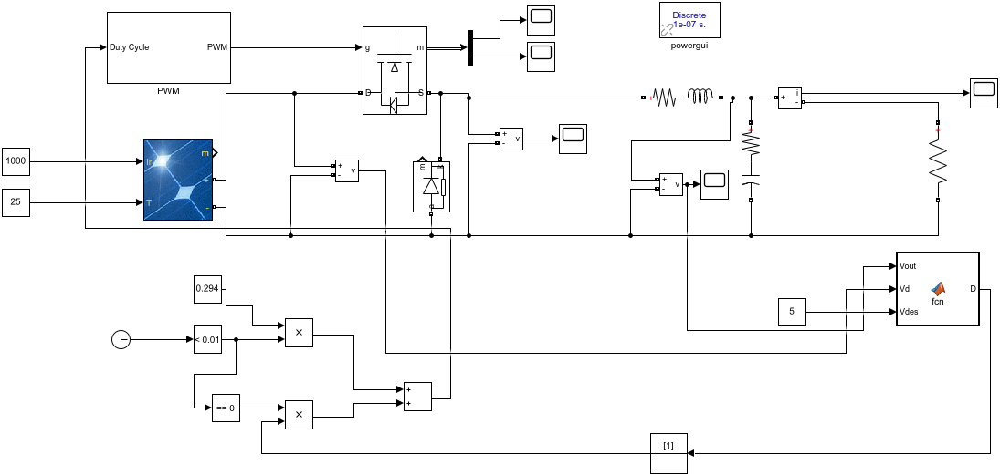

# Simulink-Design-of-12V-and-5V-battery-charging-system-from-PV-module.

This was group Project done by Me, Nicholas Wirak and Utpal Avro

Solar energy harvested by photovoltaic (PV) cell arrays can be a convenient and accessible
source of energy. It is increasingly used to augment local energy needs on the grid, as well as
provide otherwise unattainable electricity off the grid. The energy captured by PV arrays must
be transferred to batteries of various types for further storage and use. 5 and 12 Volts are
common battery voltage standards that service many vehicular and home/personal electronics
devices. The proposed system, presented in simulation, will function as a battery charger for
these devices, converting the nominal 17.5 Volt output from a common solar PV module to
usable levels. Cascaded buck-converters will be used to sequentially reduce voltage levels to 12
and then 5 Volts. In doing so, a Maximum Power Point Tracking (MPPT) algorithm and
associated control circuitry will additionally be utilized for maximal power transfer from PV cells
to battery elements. The complete system should form a stable, efficient, and self-contained 5
or 12 Volt battery charger that is safe for the batteries themselves.

# Files
**Simulink File**: This contains the design. 
**EE408_PED_FinalReport_WAT_sv3_combined**: This contains the whole details.
